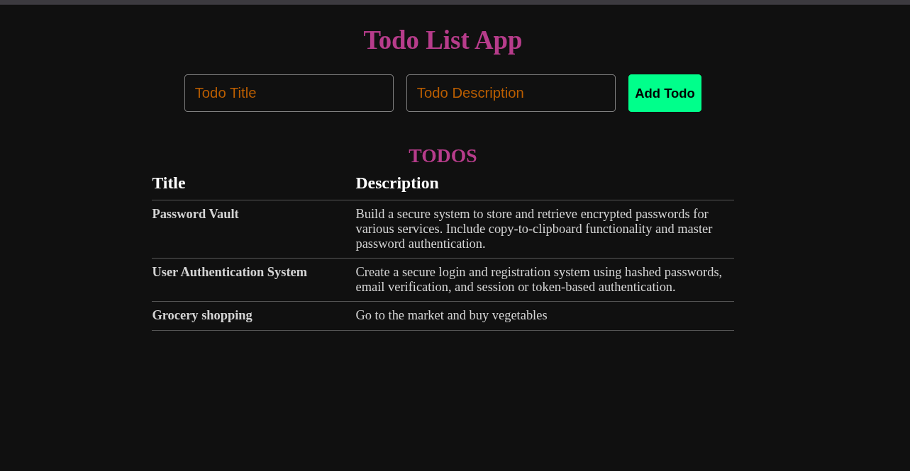

# 📝 Todo List App

A simple and responsive Todo List application built with **React** and **Vite**.  
Users can add tasks with a title and description, and view them dynamically in the interface.



## 🚀 Features

- Add new todos with a title and description
- Real-time rendering of todo items
- Form validation to ensure all fields are filled
- Clean and minimal component-based design
- Built with React functional components and Hooks


## Tech Stack

- **React** (with Hooks)
- **Vite** for fast builds and development
- **CSS** for styling

---

## Getting started

1. Clone the repo:

```bash
git clone https://github.com/charles-254/react-todoApp

cd react-todoApp
```

2. Install dependencies

```bash
npm install
```

3. Run the app

```bash
npm run dev
```